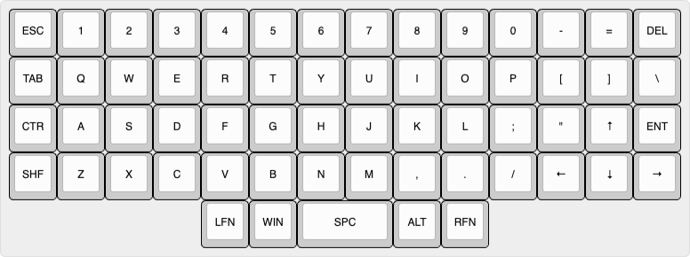
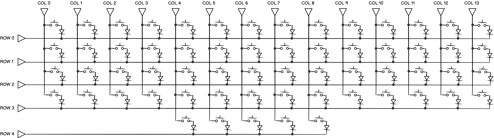
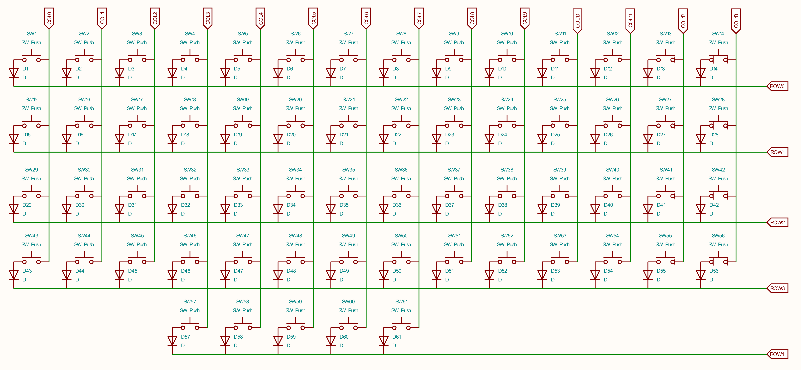

#  Ортолинейная версия Purple Owl
Ortholinear Purple Owl (OPO)

За основу взята клавиатура [Purple Owl](https://github.com/SonalPinto/purple-owl).
В качестве контроллера используется плата [Raspbery Pi Pico](https://www.raspberrypi.com/products/raspberry-pi-pico/) с прошивкой [KMK](https://github.com/KMKfw/kmk_firmware).

Раскладка сгенерироване с помощью [Keyboard Layout Editor](http://www.keyboard-layout-editor.com/#/gists/5cc3faeed62e0535db84b48822869d70) (cм.[RAW](https://github.com/wowaka/opo/blob/main/kle.txt)).

Чертеж пластины для крепления клавиш сгенерирован с помощью [ai03 Plate Generator](https://kbplate.ai03.com/) (см. [DXF](assets/plate.dxf))

Просмотровщик и редактор DXF: [SOLVESPACE](https://solvespace.com/index.pl)

Электрическая схема (монтажная сторона)

Оригинальная электрическая схема Purple Owl (со стороны клавиш)

Назначение выводов Raspberry Pi Pico 

**Что почитать**
- [DIY клавиатура из фанеры](https://habr.com/ru/articles/795727/) 
- [Разработка собственной клавиатуры для новичков](https://mkbd.ru/post/make-own-custom-keyboard/)
- [Cardboard prototyping](https://golem.hu/guide/cardboard-prototyping/)
- [Подробная инструкция по изготовлению сплит клавиатуры на основе ATmega32U4. Аналог Iris / Jiran своими руками](https://habr.com/ru/articles/515246/)
- [Какие бывают переключатели](https://geekboards.ru/page/mechanical_switches_v2)
- [Руководство Plate Builder по типам переключателей](http://builder-docs.swillkb.com/features/#switch-type)
- [Keycap Profile & Size Information](https://blog.maxkeyboard.com/dwkb/keycap-profile-size-information/)
- [Raspberry Pi Pico на МК RP2040. Как установить CircuitPython](https://habr.com/ru/articles/538994/)
- [Setting Up CircuitPython](https://github.com/CytronTechnologies/MAKER-PI-RP2040/blob/main/setup-circuitpython.md)
- [KMK Boards](https://github.com/KMKfw/kmk_firmware/tree/master/boards)
- [KMK Docs](https://github.com/KMKfw/kmk_firmware/tree/master/docs/en)
- [Keys Overview](https://github.com/KMKfw/kmk_firmware/blob/master/docs/en/keycodes.md)
- [Scotto108 Handwired Keyboard](https://scottokeebs.com/blogs/keyboards/scotto108-handwired-keyboard)

**Что посмотреть**
- [Как я сделал самодельную механическую клавиатуру](https://www.youtube.com/watch?v=X6o-x2BWEV4)
- [How to Improve Your Handwired Keyboards](https://www.youtube.com/watch?v=m7Q5ZjqN-ao)
- [How to Build a Handwired Keyboard](https://www.youtube.com/watch?v=hjml-K-pV4E)
- [Setting up KMK on a Pi Pico mechanical keyboard](https://www.youtube.com/watch?v=i43lZPAkA2c)
- [Install CircuitPython on Raspberry Pi Pico](https://www.youtube.com/watch?v=1xctZfhZt_g)
- [Soldering Raspberry Pi Pico](https://www.youtube.com/watch?v=u3A2UhlUC2w)
