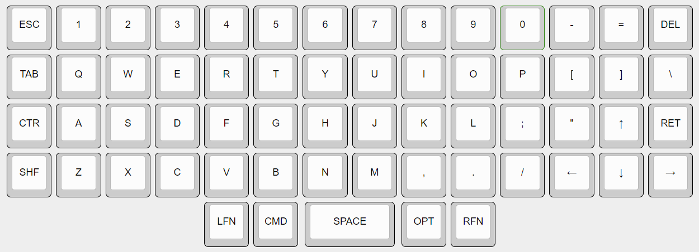
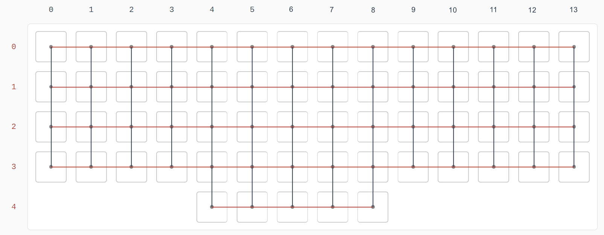

#  Ортолинейная версия Purple Owl
Ortholinear Purple Owl (OPO)

За основу взята клавиатура [Purple Owl](https://github.com/SonalPinto/purple-owl).
В качестве контроллера используется плата [Raspbery Pi Pico](https://www.raspberrypi.com/products/raspberry-pi-pico/) с прошивкой [KMK](https://github.com/KMKfw/kmk_firmware).

Раскладка сгенерироване с помощью [Keyboard Layout Editor](http://www.keyboard-layout-editor.com/#/gists/5cc3faeed62e0535db84b48822869d70) (cм.[RAW](https://github.com/wowaka/opo/blob/main/kle.txt)).

Чертеж пластины для крепления клавиш сгенерирован с помощью [ai03 Plate Generator](https://kbplate.ai03.com/) (см. [DXF](assets/plate.dxf))

Просмотровщик и редактор DXF: [SOLVESPACE](https://solvespace.com/index.pl)

Cхема соединений клавиш сгенерирована с помощью [Keyboard Firmware Builder](https://kbfirmware.com/)

**Что почитать**
- [Разработка собственной клавиатуры для новичков](https://mkbd.ru/post/make-own-custom-keyboard/)
- [Cardboard prototyping](https://golem.hu/guide/cardboard-prototyping/)
- [Подробная инструкция по изготовлению сплит клавиатуры на основе ATmega32U4. Аналог Iris / Jiran своими руками](https://habr.com/ru/articles/515246/)
- [Какие бывают переключатели](https://geekboards.ru/page/mechanical_switches_v2)
- [Руководство Plate Builder по типам переключателей](http://builder-docs.swillkb.com/features/#switch-type)
- [Keycap Profile & Size Information](https://blog.maxkeyboard.com/dwkb/keycap-profile-size-information/)

**Что посмотреть**
- Как я сделал самодельную механическую клавиатуру: https://www.youtube.com/watch?v=X6o-x2BWEV4
- Микроконтроллер: RP2040 Raspberry Pi Pico Часть 1 Начало работы с Micropython в PyCharm и Thonny IDE: https://www.youtube.com/watch?v=Yokaa3KJCAM
- How to Improve Your Handwired Keyboards: https://www.youtube.com/watch?v=m7Q5ZjqN-ao
- Setting up KMK on a Pi Pico mechanical keyboard: https://www.youtube.com/watch?v=i43lZPAkA2c

**Клавиши**
- Kailh Box: https://www.keychron.com/products/kailh-box-switch-set
- Stabilizer Set: https://www.keychron.com/products/keychron-gold-plated-pcb-mounted-stabilizer-set
- Вики: https://wiki.geekboards.ru/switches/kailh/kailh-box-brown/
