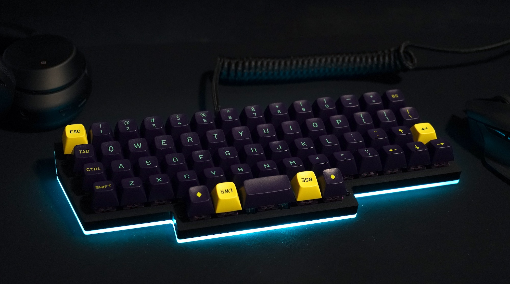
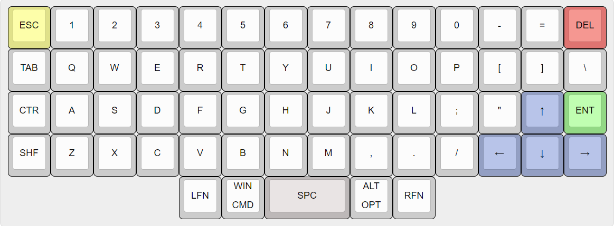
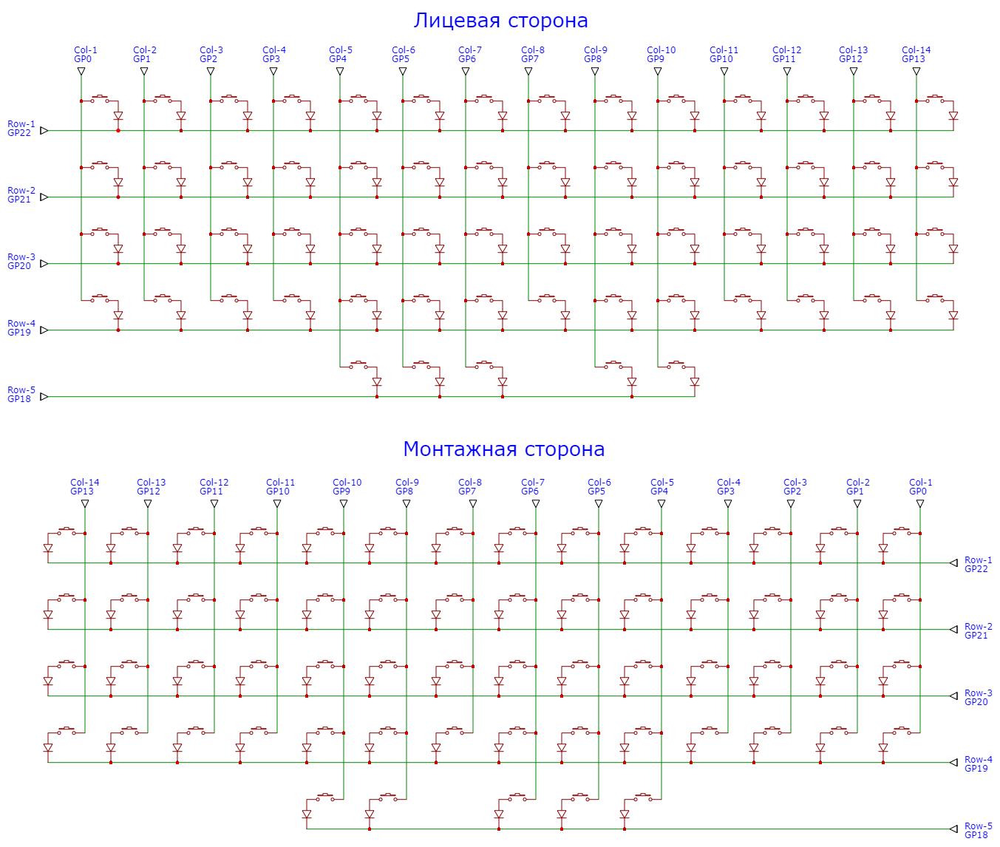
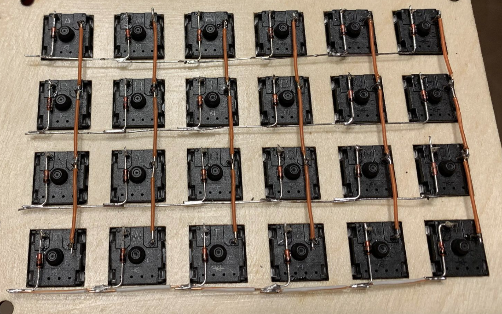
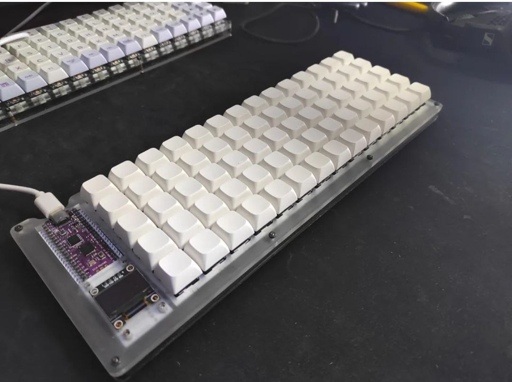

#  Ортолинейная версия Purple Owl
Ortholinear Purple Owl (OPO)

За основу взята клавиатура [Purple Owl](https://github.com/SonalPinto/purple-owl).
В качестве контроллера используется плата [Raspbery Pi Pico](https://www.raspberrypi.com/products/raspberry-pi-pico/) с прошивкой [KMK](https://github.com/KMKfw/kmk_firmware). Раскладка сгенерироване с помощью [Keyboard Layout Editor](http://www.keyboard-layout-editor.com/#/gists/5cc3faeed62e0535db84b48822869d70) (cм.[RAW](https://github.com/wowaka/opo/blob/main/kle.txt)).

Раскладка Windows/Linux/OSX

["Раздельная" раскладка](assets/alternative3.png)

Чертеж пластины для крепления клавиш сгенерирован с помощью [ai03 Plate Generator](https://kbplate.ai03.com/) (см. [DXF](assets/plate.dxf))

Просмотровщик и редактор DXF: [SOLVESPACE](https://solvespace.com/index.pl)

Электрическая схема

[Электрическая схема "раздельной" раскладки](assets/schema_alt3.png)

Пример монтажа. Источник: [https://habr.com/ru/articles/795727/](https://habr.com/ru/articles/795727/)

Варианты корпуса

Пример расположения контроллера

Назначение выводов Raspberry Pi Pico 

**Что почитать**
- [DIY клавиатура из фанеры](https://habr.com/ru/articles/795727/)
- [Commodore 64 Mechanical Keyboard, Part 2](https://bestguy.github.io/site/keyboard/2018/01/09/c64part2.html)
- [A modern handwiring guide](https://geekhack.org/index.php?topic=87689.0)
- [Разработка собственной клавиатуры для новичков](https://mkbd.ru/post/make-own-custom-keyboard/)
- [Раскладка Ильи Шепрута](https://optozorax.github.io/p/my-keyboard-layout/)
- [Mechanical Keyboard and where to find them](https://github.com/kaos-XIII/List-Mechanical-Keyboard)
- [Какие бывают переключатели](https://geekboards.ru/page/mechanical_switches_v2)
- [Руководство Plate Builder по типам переключателей](http://builder-docs.swillkb.com/features/#switch-type)
- [Keycap Profile & Size Information](https://blog.maxkeyboard.com/dwkb/keycap-profile-size-information/)
- [Raspberry Pi Pico на МК RP2040. Как установить CircuitPython](https://habr.com/ru/articles/538994/)
- [Setting Up CircuitPython](https://github.com/CytronTechnologies/MAKER-PI-RP2040/blob/main/setup-circuitpython.md)
- [KMK Boards](https://github.com/KMKfw/kmk_firmware/tree/master/boards)
- [KMK Docs](https://github.com/KMKfw/kmk_firmware/tree/master/docs/en)
- [Keys Overview](https://github.com/KMKfw/kmk_firmware/blob/master/docs/en/keycodes.md)
- [ScottoKeebs](https://scottokeebs.com/)
- [Boardsource](https://www.boardsource.xyz/)

**Что посмотреть**
- [A DIY 3D Printed and Handwired Custom](https://www.youtube.com/watch?v=iOeYkLlq9Ds)
- [How to Design Mechanical Keyboard Plates and Cases](https://www.youtube.com/watch?v=7azQkSu0m_U)
- [How to Design Mechanical Keyboard PCBs with Kicad](https://www.youtube.com/watch?v=8WXpGTIbxlQ)
- [Setting up KMK on a Pi Pico mechanical keyboard](https://www.youtube.com/watch?v=i43lZPAkA2c)
- [Install CircuitPython on Raspberry Pi Pico](https://www.youtube.com/watch?v=1xctZfhZt_g)
- [Soldering Raspberry Pi Pico](https://www.youtube.com/watch?v=u3A2UhlUC2w)
